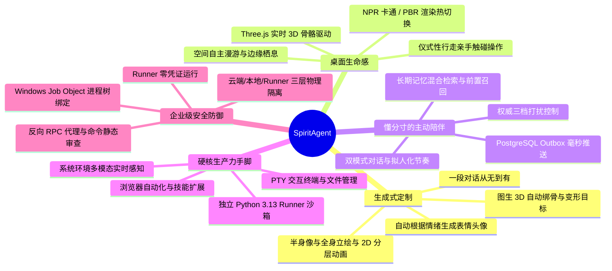

<div align="center">


# SpiritAgent

**一个根据自然语言描述定制的、具有专属 3D 形象与长期记忆的陪伴型桌面伙伴**

*定制专属形象 · 常驻桌面陪伴 · 懂分寸的主动关怀 · 真实可用的本地生产力手脚*

[](#)
[](#)
[](#)
[](#)

</div>

---

## 🌟 视觉呈现：从“蛋”到专属 3D 伙伴的诞生

SpiritAgent 区别于传统桌面宠物或纯聊天插件的核心，在于伙伴拥有**从无到有的生成式诞生闭环**：从一颗温润呼吸的“蛋”开始，经自然对话定制形象与人格，最终成为常驻桌面的专属 3D 伙伴。生成体验见 [DESIGN.md](DESIGN.md)，3D 能力链见 [docs/PIPELINE.md](docs/PIPELINE.md)。

| 1. 初始破壳「蛋」形态 | 2. 对话定制半身像 | 3. 全身立绘：日系赛璐珞 | 4. 全身立绘：二次元游戏CG | 5. 专属 3D 伙伴·实机演示 |
| :---: | :---: | :---: | :---: | :---: |
|  |  |  |  | <video src="docs/assets/clip.mp4" width="200" autoplay loop muted playsinline></video> |
| *安装初始·静候唤醒* | *性格与样貌确认* | *风格样图一（赛璐珞）* | *风格样图二（游戏CG）* | *骨骼动画·实时驱动* |

---

## 🚀 为什么选择 SpiritAgent？核心优势



### 1. 🎨 自然语言驱动的“无中生有”定制
* **无需 3D 建模基础与外部资产**：你只需像和新朋友聊天一样描述名字、物种、性格、说话风格与外貌，AI 即可自动化完成半身像绘制、全身立绘生成、2D 分层动画资产切分，并按供应商能力派生多视图与图生 3D 绑骨建模。
* **视觉永不空白（多级降级兜底）**：`2D 分层动画 ➔ 2D 骨骼动画 ➔ 3D 模型 ➔ 程序化蛋形` 级联兜底，即便无网络或在生成空挡期，角色也时刻维持生动呼吸，绝不出现卡死或空白加载态。

### 2. 🦾 拥有真实“手和脚”的桌面生产力（Runner）
* **不只是聊天挂件，更是桌面超级 Agent**：搭载独立的本地 Python 3.13 Runner，支持交互式 PTY 终端、文件读写沙箱、Playwright 浏览器自动化与系统级环境感知。
* **可扩展的本地工具体系**：内置 Skills、代码执行、文件与终端工具，让伙伴在桌面上真正解决编程、写脚本、查资料等复杂任务。

### 3. 🕊️ 细腻的桌面空间自主性与“仪式性行走”
* **不是钉在屏幕角落的死板贴图**：伙伴拥有空间自主意识，会在桌面静默漫游（`roam`）、栖息在你的 IDE 或工作窗口边缘（`perch`）。
* **仪式性行走（Ritual Walk）**：当让伙伴打开应用或点击按钮时，它会走/飞到目标窗口旁**亲手触碰执行**，将冷冰冰的后台 API 调用转变为充满生命力的沉浸式角色行为。

### 4. 🧠 懂分寸的主动陪伴与长期记忆
* **主动关怀而非被动应答**：依托 PostgreSQL LISTEN/NOTIFY + Outbox 机制与夜间自主反思，伙伴会主动发起问候、定时提醒与情境化闲聊。
* **严格的三档打扰控制（静止 / 常规 / 自主）**：客户端权威感知当前用户状态（全屏、游戏等沉浸式上下文），自动切换免打扰档位，做到“需要时在身边，忙碌时不添乱”。
* **双模式对话与拟人化节奏**：支持 IM 式气泡交互与半双工语音通话模式；支持连发消息合并窗口与情绪/动作/文字/空间四通道解耦响应。

### 5. 🛡️ 工业级三模块物理解耦与安全隔离
* **物理隔离架构**：
  * **云端大脑 (Backend)**：负责大模型编排、长期记忆、角色定义与资产生成，**绝不接触**用户本地操作系统；
  * **桌面枢纽 (Client)**：Electron 原生凭证加密保护 (safeStorage)，作为唯一可信网关路由双向流量与管理 Runner 进程生命周期；
  * **本地手脚 (Runner)**：**零凭证**孤立运行，所有大模型调用经 Client 代理，彻底阻断 Prompt 注入与凭据泄露风险；Windows Job Object 内核级绑定防孤儿进程。

---

## 🏗️ 架构拓扑

```
     ┌─────────────────────────────────────────────────────────────┐
     │                        Backend (云端)                       │
     │                   FastAPI + PostgreSQL + asyncio             │
     │  - 伙伴人格（角色定义持久化 + 长期/短期记忆管理）           │
     │  - 专属形象资产生成编排（半身像 + 多风格立绘 + 图生 3D 能力链）│
     │  - LLM 编排与系统提示词装配 / Outbox 事件发布               │
     └─────────────────────────┬───────────────────────────────────┘
                               │ WebSocket 长连接（JWT 鉴权）
     ┌─────────────────────────▼───────────────────────────────────┐
     │                        Client (本地)                        │
     │             Electron 42 + React 19 + Three.js 引擎          │
     │  - 桌面精灵 3D 实时渲染、骨骼表情驱动与空间状态机           │
     │  - NPR 卡通渲染 / PBR 真实感渲染热切换                      │
     │  - 凭证安全落盘 (safeStorage) / 本地 IPC 枢纽中转            │
     │  - 权威打扰档位感知与计算 / 独立 3D 调试器 (pnpm clip)      │
     └─────────────────────────┬───────────────────────────────────┘
                               │ 本地 OS IPC（命名管道 / UDS + 握手 Token）
     ┌─────────────────────────▼───────────────────────────────────┐
     │                        Runner (本地)                        │
     │                    Python 3.13 隔离进程                     │
     │  - 本地环境执行器（PTY 交互终端、文件沙箱、浏览器控制）     │
     │  - 本地工具安全扫描与审查 / Skills 平台过滤                 │
     │  - 零凭证孤立运行 / 反向 RPC 代理中转                       │
     └─────────────────────────────────────────────────────────────┘
```

---

## ⚡ 4 步极速本地开始 (Quick Start)

只需简单 4 步，即可在本地完整运行 SpiritAgent：

### 第 1 步：准备后端配置文件
进入 `backend` 目录，复制配置模板并填入你的大模型 / 生图 API Key：
```bash
cd backend
cp config.toml.example config.toml
# 编辑 config.toml 填入相关 API 密钥（如 mimo / minimax / gemini / tripo 等）
```

### 第 2 步：一键构建并启动后端服务
在 `backend` 目录下通过 Docker Compose 启动云端大脑与数据库服务：
```bash
docker compose up -d --build
```
> 服务将在本地 `http://localhost:10620` 运行，内置 PostgreSQL 数据库自动完成迁移。

### 第 3 步：注册用户并获取激活码
打开浏览器访问 `http://localhost:10620`（默认管理员账号 `spiritagent` / 密码 `spiritagent@admin123`），创建或使用现有用户，复制系统为你生成的专属**激活码**。

### 第 4 步：启动桌面客户端
进入 `client` 目录，安装依赖并启动 Electron 桌面客户端：
```bash
cd ../client
pnpm install
pnpm dev
```
> 首次启动客户端时，粘贴第 3 步获取的激活码，即可立即进入桌面上那一颗温暖的“蛋”，开启你的专属伙伴破壳定制之旅！

---

## 📚 详细文档导航

| 想了解什么 | 推荐阅读 | 说明 |
| :--- | :--- | :--- |
| **系统架构与物理边界** | [ARCHITECTURE.md](ARCHITECTURE.md) | 深入了解三模块物理隔离、通信链路、跨模块不变量 |
| **伙伴交互与产品设计** | [DESIGN.md](DESIGN.md) | 形象体系、动画状态机、空间行为、Onboarding 生命周期与陪伴范式 |
| **跨模块协议与安全契约** | [PROTOCOL.md](PROTOCOL.md) | JSON-RPC 2.0 方法规范、事件流、枚举定义、四层安全防御机制 |
| **后端核心实现 (Backend)** | [backend/README.md](backend/README.md) | FastAPI 架构、数据模型、记忆管理、Prompt 装配与 3D 能力链 |
| **桌面客户端实现 (Client)** | [client/README.md](client/README.md) | Three.js 渲染引擎、Electron 主进程、动画状态机与表情驱动 |
| **本地手脚执行器 (Runner)** | [runner/README.md](runner/README.md) | PTY 终端实现、Playwright 浏览器自动化与工具库 |
| **安装器与引导机制 (Installer)** | [installer/README.md](installer/README.md) | Tauri 2 极简轻量安装引导与环境配置流程 |
| **3D 与 2D 模型生成能力链与产物契约** | [docs/PIPELINE.md](docs/PIPELINE.md) | 链拓扑、供应商能力、产物契约与客户端兑现策略 |
| **构建与仓库级脚本** | [scripts/README.md](scripts/README.md) | 安装包构建、导入检查与脚本工具说明 |
| **代码与协作开发规范** | [RULES.md](RULES.md) | 仓库代码风格、文档更新原则、Git Commit 提交模板 |
