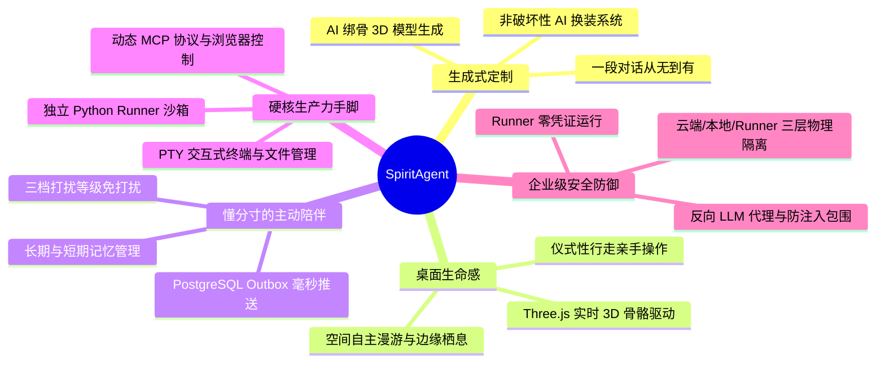

<div align="center">


# SpiritAgent

**一个根据自然语言描述定制的、具有专属 3D 形象与长期记忆的陪伴型桌面伙伴**

*定制专属形象 · 常驻桌面陪伴 · 懂分寸的主动关怀 · 真实可用的本地生产力手脚*

[](#)
[](#)
[](#)
[](#)

</div>

---

## 🌟 视觉呈现：从“蛋”到专属 3D 伙伴的诞生

SpiritAgent 区别于传统桌面宠物或纯聊天插件的核心，在于伙伴拥有**从无到有的生成式诞生闭环**。首次安装时它是一颗温润呼吸的“蛋”，在完成一段温暖自然的对话后，系统将即时生成专属的 2D 肖像、全身立绘与高精 3D 骨骼模型：

| 1. 初始破壳「蛋」形态 | 2. 对话定制生成头像 | 3. 3D 建模锚点全身图 | 4. 专属精灵 3D / 相册立绘 |
| :---: | :---: | :---: | :---: |
|  |  |  |  |
| *安装初始·静候唤醒* | *性格与样貌确认* | *全身轮廓与骨骼锚点* | *常驻桌面·活灵活现* |

---

## 🚀 为什么选择 SpiritAgent？核心优势



### 1. 🎨 自然语言驱动的“无中生有”定制
* **无需 3D 建模基础与外部资产**：你只需像和新朋友聊天一样描述名字、物种、性格、说话风格与外貌，AI 即可自动化完成概念图绘制、三维网格生成与骨骼绑定。
* **非破坏性换装系统**：提供预设材质、AI PBR 纹理贴图（秒级热替）与几何服装装配，**无需重新耗时生成 3D 模型**即可自由随心换装。
* **视觉永不空白（3 级降级兜底）**：`3D GLB 模型 ➔ 静态精灵相册 ➔ 算法正弦蛋形` 级联兜底，即便无网络或在生成空挡期，角色也时刻维持生动呼吸，绝不出现卡死或空白加载态。

### 2. 🦾 拥有真实“手和脚”的桌面生产力（Runner + MCP）
* **不只是聊天挂件，更是桌面超级 Agent**：搭载独立的本地 Python 3.13 Runner，支持交互式 PTY 终端、文件读写沙箱、Playwright 浏览器自动化。
* **原生支持 MCP（Model Context Protocol）**：可无缝接入标准 MCP 服务生态，让伙伴调度各种本地工具帮你在桌面上真正解决编程、写脚本、查资料等复杂任务。

### 3. 🕊️ 细腻的桌面空间自主性与“仪式性行走”
* **不是钉在屏幕角落的死板贴图**：伙伴拥有空间自主意识，会在桌面静默漫游（`roam`）、栖息在你的 IDE 或工作窗口边缘（`perch`）、或在深夜移至安静角落打瞌睡（`sleep`）。
* **仪式性行走（Ritual Walk）**：当让伙伴打开应用或点击按钮时，它会走/飞到目标窗口旁**亲手触碰执行**，将冷冰冰的后台 API 调用转变为充满生命力的沉浸式角色行为。

### 4. 🧠 懂分寸的主动陪伴与长期记忆
* **主动关怀而非被动应答**：依托 PostgreSQL LISTEN/NOTIFY + Outbox 机制，伙伴会主动发起问候、定时提醒与情境化闲聊。
* **严格的三档打扰控制（Active / Normal / Quiet）**：客户端权威感知当前用户状态（全屏游戏、沉浸式工作或专注窗口），自动切换免打扰档位，做到“需要时在身边，忙碌时不添乱”。

### 5. 🛡️ 工业级三模块物理解耦与安全隔离
* **物理隔离架构**：
  * **云端大脑 (Backend)**：负责大模型编排、长期记忆与资产生成，**绝不接触**用户本地操作系统；
  * **桌面枢纽 (Client)**：Electron 原生凭证加密保护，作为安全网关路由双向流量；
  * **本地手脚 (Runner)**：**零凭证**孤立运行，所有大模型调用经 Client 代理，彻底阻断 Prompt 注入与凭据泄露风险。

---

## 🏗️ 架构拓扑

```
     ┌─────────────────────────────────────────────────────────────┐
     │                        Backend (云端)                       │
     │                   FastAPI + PostgreSQL + Worker             │
     │  - 伙伴人格（角色定义 + 长期/短期记忆管理）                 │
     │  - 专属形象资产生成编排（2D 头像 + 3D 建模 + 纹理换装）     │
     │  - LLM 编排与系统提示词装配 / Outbox 事件发布               │
     └─────────────────────────┬───────────────────────────────────┘
                               │ WebSocket 长连接（JWT 鉴权）
     ┌─────────────────────────▼───────────────────────────────────┐
     │                        Client (本地)                        │
     │             Electron 42 + React 19 + Three.js 引擎          │
     │  - 桌面精灵 3D 实时渲染、骨骼表情驱动与空间状态机           │
     │  - 凭证安全落盘 (safeStorage) / 本地 IPC 枢纽中转            │
     └─────────────────────────┬───────────────────────────────────┘
                               │ 本地 OS IPC（命名管道 / UDS + 握手 Token）
     ┌─────────────────────────▼───────────────────────────────────┐
     │                        Runner (本地)                        │
     │                    Python 3.13 隔离进程                     │
     │  - 本地环境执行器（PTY 交互终端、文件沙箱、浏览器控制）     │
     │  - 动态 MCP 客户端协议集成 / 本地工具安全扫描               │
     └─────────────────────────────────────────────────────────────┘
```

---

## ⚡ 4 步极速本地开始 (Quick Start)

只需简单 4 步，即可在本地完整运行 SpiritAgent：

### 第 1 步：准备后端配置文件
进入 `backend` 目录，复制配置模板并填入你的大模型 / 生图 API Key：
```bash
cd backend
cp config.toml.example config.toml
# 编辑 config.toml 填入相关 API 密钥（如 mimo / minimax / gemini / tripo 等）
```

### 第 2 步：一键构建并启动后端服务
在 `backend` 目录下通过 Docker Compose 启动云端大脑与数据库服务：
```bash
docker compose up -d --build
```
> 服务将在本地 `http://localhost:10620` 运行，内置 PostgreSQL 数据库自动完成迁移。

### 第 3 步：注册用户并获取激活码
打开浏览器访问 `http://localhost:10620`（默认管理员账号 `spiritagent` / 密码 `spiritagent@admin123`），创建或使用现有用户，复制系统为你生成的专属**激活码**。

### 第 4 步：启动桌面客户端
进入 `client` 目录，安装依赖并启动 Electron 桌面客户端：
```bash
cd ../client
pnpm install
pnpm dev
```
> 首次启动客户端时，粘贴第 3 步获取的激活码，即可立即进入桌面上那一颗温暖的“蛋”，开启你的专属伙伴破壳定制之旅！

---

## 🛠️ 开发者专属：3D 模型与动画快速调试工具 (`pnpm clip`)

在调整 3D 生成管线、测试自定义 GLB 模型、验证自动绑骨或微调动画库时，**无需等待 LLM 链路**，直接运行独立调试器：

```bash
# 根目录或 client/ 目录下均可一键启动
pnpm clip
```

- **直连后端模型**：粘贴管理后台激活码，一键自动拉取当前伴侣的 `.glb` 模型（支持流式 Gzip 解压与 71° 手臂自然下垂 Rest Pose 映射）；
- **全量动画测试**：支持 7 大骨骼体系（人形双足 / 四足动物 / 飞禽鸟类等）100+ 动作即点即播、交叉淡入淡出、倍速与单帧步进；
- **智能姿态纠偏**：自动识别 Z-up 平躺模型并立起、自动双脚贴地与水平居中；
- **3D 交互手柄**：内置 TransformControls（位移 / 旋转 / 缩放）坐标轴拖拽与精确数值微调；
- **表情与嘴型**：支持 52 维面部 Blendshape 调节与 TTS 口型振幅模拟。

---

## 📦 客户端安装包构建 (Release)

如需分发给最终用户，可使用一键脚本打包原生安装器（包含 Installer 引导器与 Runner 运行时）：

```bash
# Windows 平台
pwsh scripts/build_client.ps1

# macOS 平台
bash scripts/build_client.sh
```

**产物说明**：
* `release/SpiritAgent-Setup-{ver}.exe` (Windows) / `.dmg` (macOS)：全新安装与修复程序。
* `release/SpiritAgent-{ver}-update.zip`：静默增量自更新包（可通过后台管理界面上传发布）。

---

## 📚 详细文档导航

| 想了解什么 | 推荐阅读 | 说明 |
| :--- | :--- | :--- |
| **系统架构与物理边界** | [ARCHITECTURE.md](ARCHITECTURE.md) | 深入了解三模块物理隔离、通信链路、跨模块不变量 |
| **伙伴交互与产品设计** | [DESIGN.md](DESIGN.md) | 形象体系、动画状态机、空间行为、Onboarding 生命周期与陪伴范式 |
| **跨模块协议与安全契约** | [PROTOCOL.md](PROTOCOL.md) | JSON-RPC 2.0 方法规范、事件流、枚举定义、四层安全防御机制 |
| **后端核心实现 (Backend)** | [backend/README.md](backend/README.md) | FastAPI 架构、数据模型、记忆管理、Prompt 装配与渲染 Worker |
| **桌面客户端实现 (Client)** | [client/README.md](client/README.md) | Three.js 渲染引擎、Electron 主进程、状态机与换装热替 |
| **本地手脚执行器 (Runner)** | [runner/README.md](runner/README.md) | PTY 终端实现、Playwright 浏览器自动化、MCP 客户端与工具库 |
| **安装器与引导机制 (Installer)** | [installer/README.md](installer/README.md) | Tauri 2 极简轻量安装引导与环境配置流程 |
| **3D 模型与骨骼规范** | [docs/MODEL_SPEC.md](docs/MODEL_SPEC.md) | 骨骼命名、动画 Clip 映射、Morph 表情规范说明 |
| **代码与协作开发规范** | [RULES.md](RULES.md) | 仓库代码风格、文档更新原则、Git Commit 提交模板 |
