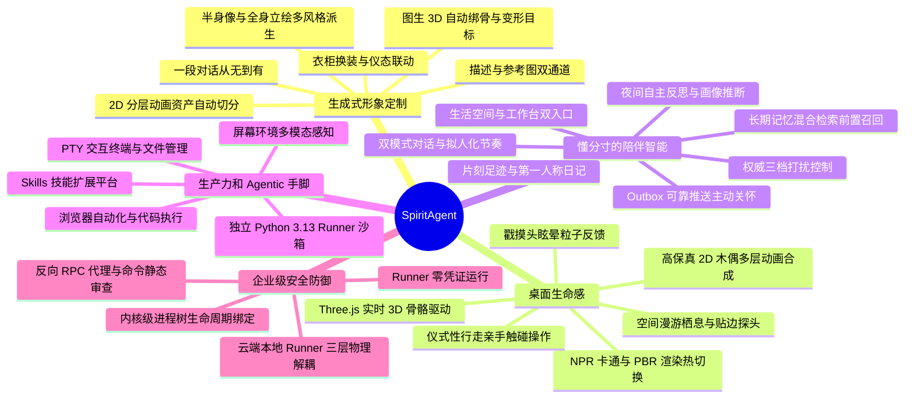

<div align="center">


# SpiritAgent

**一段话或一张参考图，从“蛋”里孵出独属于你的 2D / 3D 桌面伙伴——有记忆、懂分寸、还能像Agent一样真正替你干活**

*AI 从零生成专属形象 · Agentic 本地生产力 · 有分寸的主动陪伴 · 永远鲜活的桌面生命感*

[](#)
[](#)
[](#)
[](#)

</div>

---

## 🌟 视觉呈现：从一颗“蛋”到专属伙伴的诞生

SpiritAgent 最独特的地方，是伙伴有一个**从无到有的诞生过程**：安装后屏幕上只有一颗温润呼吸的“蛋”，唤醒它，用几句自然语言告诉它你想让它长什么样——随后 AI 自动完成半身像绘制、全身立绘生成，一路派生出会动会活的 2D 分层木偶或云端建模的 3D 骨骼形象。

### 诞生之旅

| 1. 初始破壳「蛋」形态 | 2. 对话定制半身像 | 3. 全身立绘：日系赛璐珞（2D 默认画风） | 4. 全身立绘：二次元游戏CG（3D 类人画风） |
| :---: | :---: | :---: | :---: |
|  |  |  |  |
| *安装初始·静候唤醒* | *性格与样貌确认* | *2D 分层切分的身份锚* | *图生 3D 建模的输入* |

### 双形态实机演示（2D 与 3D 并列一等公民，设置内随时切换）

| 💠 2D 分层木偶 | 🧊 3D 骨骼模型 |
| :---: | :---: |
| <video src="docs/assets/2d-demo.mp4" width="220" controls autoplay loop muted playsinline></video> | <video src="docs/assets/3d-demo.mp4" width="220" controls autoplay loop muted playsinline></video> |
| *立绘画风完整还原·伪 3D 转头·物理摆动* | *云端绑骨建模·骨骼动画实时驱动* |

---

## ⚔️ 它不是又一个桌宠

SpiritAgent 在每一个维度上都与常见桌宠不同：

| 维度 | 传统桌宠 / Live2D 看板娘挂件 | SpiritAgent |
| :--- | :--- | :--- |
| **形象从哪来** | 美术预制的固定贴图包，所有人用的是同一个形象，换皮肤等于重新买一套 | **用一段自然语言描述、或丢一张参考图，从零“孵化”出全世界独一无二的形象**：AI 自动完成半身像 → 全身立绘 → 2D 分层木偶 或 图生 3D 绑骨建模，全程零美术资产、零建模基础 |
| **动起来什么样** | 数帧循环 GIF、触发式的预制动画列表 | **逐帧实时合成的生命体**：高保真 2D 木偶带伪 3D 转头、发束裙摆弹簧物理、呼吸眨眼视线跟随、随语音振幅开合的嘴型；3D 为云端烘焙骨骼动画的实时渲染，NPR 卡通 / PBR 写实一键热切换，还会按情绪驱动丰富的肢体语言与状态切换 |
| **有没有脑子** | 无。所有回应都是作者提前写死的脚本台词 | **真正的 LLM 大脑**：结构化角色定义（名字 / 物种 / 性格 / 说话风格 / 音色）+ 长期记忆混合检索。它说的每句话、做的每个反应都从“人设 + 对你的记忆”现场推理派生，千人千面 |
| **能不能干活** | 不能。卖萌、整点报时是天花板 | **Claude Code / Codex 级的 agentic 工具链**：交互终端、文件读写沙箱、浏览器自动化、代码执行、屏幕截图视觉理解、可扩展技能平台——让伙伴在桌面上跑命令、改代码、查资料、做研究，真正交付工作成果 |
| **会不会打扰人** | 定时弹窗式骚扰，关不掉或一刀切 | **三档打扰控制**：全屏游戏 / 沉浸应用自动静默；静止档从源头切断一切主动 LLM 调用；自主档才会漫游、栖息到窗口旁、甚至走过来找你搭话。懂分寸是产品核心，不是附加开关 |
| **出错什么表现** | 白屏、红叉、报错弹窗 | **一切故障人格化**：网络断了打哈欠走神、生成没好说“我还没想好…”、渲染失败自动降级继续陪伴——三层视觉级联兜底，伙伴永远“活着，只是遇到点状况” |

---

## 🚀 为什么选择 SpiritAgent？核心优势全景



### 1. 🎨 自然语言与参考图驱动的“无中生有”定制

* **像聊天一样孵化形象**：十三步对话式引导收齐名字、物种、性别、外貌、关系定位、性格与说话风格；支持附一张参考图让 AI “照着这张图画自己”，文字与图片并存不互斥。中途崩溃退出也不丢进度，下次启动从上一个未答问题继续。
* **全自动形象流水线**：确认半身像锚定身份后，AI 依次完成全身立绘（画风与画幅随物种骨骼形态自适应）、22 层语义 PSD 切分（含遮挡区域补全）派生 2D 分层木偶，或经图生 3D 能力链完成多视角生成、云端绑骨与预设动作绑定——分钟级的生成等待被隐藏在后续对话间隙中。
* **参考图的两种语义**：基础形象参考图是永久**身份锚点**，每次重生都会携带；风格参考图只影响构图与呈现形式，两者共存互不覆盖。形象一旦确认即在服务端强制锁定，杜绝误触重生白烧付费额度。
* **衣柜换装（2D）**：一句着装描述起稿，草稿可反复微调重绘，确认后自动重跑分层切分且旧装穿在新装就绪前不断档。服装还会反哺伙伴的自我认知——泳装让张扬的角色更放松撩人、却让害羞内敛的角色感到局促：**衣着只是情境，性格始终是行为的主宰**。
* **视觉永不空白（三级降级兜底）**：`2D 分层木偶 ➔ 3D 模型 ➔ 程序化蛋形` 级联兜底。即便无网络、资产生成中或失败，角色也时刻维持生动呼吸，绝不出现卡死或空白加载态。

### 2. ✨ 会呼吸的动画呈现：2D 木偶与 3D 骨骼双引擎

* **每一帧都在“活”**：遵循“永远不要完全静态”的设计哲学——非对称呼吸、眨眼曲线、视线微扫视等持续微动层时刻运转；空闲时随机插入伸懒腰、环顾四周等观察段落，用户不操作它也自己动。
* **高保真 2D 木偶**（默认）：分层画稿装配为可形变网格，圆投影伪 3D 转头（视线先动、头与上身同源跟随）、眉嘴眼参数化面部情绪通道、发束弹簧链与裙摆双频摆动、TTS 振幅接管嘴型，画风完全还原立绘。
* **3D 骨骼引擎**：Three.js 实时渲染云端生成的含动画 GLB 模型，按物种骨架匹配预设动作库（行走、大笑、哭泣……），供应商能力缺位自动跳过、缺失键回退空闲动画。
* **四通道解耦响应**：把一次回复拆成情绪、动作、文字、空间四条彼此独立的通道，由 LLM 声明意图分别触发——它可以只噘嘴不说话，可以连发好几条短消息，也可以一句话不说就走过去。纯表情反应也会写进记忆：“它记得自己刚才生气了”。

### 3. 🕊️ 拥有空间意识的桌面精灵与“仪式性行走”

* **不是钉死在角落的贴图**：伙伴具备空间自主性——会在桌面游荡（roam），在你专注工作时主动飞来栖息在你的 IDE 或文档窗口边缘陪你加班（perch），还会走到屏幕边只露出小脑袋探头偷看，悬停才肯滑出来。
* **仪式性行走（Ritual Walk）**：当让它打开应用或点击按钮时，它会先走到目标窗口旁、视线锁定目标、抬手做出触碰动作——“动手”是有空间过程的角色行为，而不是一次冷冰冰的后台 API 调用。
* **走过去搭话**：自主档下闲置太久，它会自己走过来、站在你的焦点窗口旁就地栖身，主动开口找你聊天；是否挪窝、何时挪窝由云端结合人设决策，“不动”也是被允许的选择。
* **直接互动有脾气**：轻戳中戳重戳递进反馈、摸头眯眼发射爱心粒子（💖）、连戳暴怒十字（💢）、高频连戳眩晕星环（💫）；文件拖到它身上会被开心地“接住”。同一操作在不同人格上有完全不同的反应——粘人型撒娇、毒舌型吐槽、管家型礼貌应答。
* **拖放定居与自适应缩放**：拖到哪松手就在哪定居并持久化；空间不够时自动缩小栖身，搞怪情绪时短暂放大蹦跳再平滑回落，全程 0.3×–3× 无级缩放。

### 4. 🦾 具备干活能力的 Agentic 本地生产力

* **不只是聊天挂件，更是桌面超级 Agent**：搭载独立运行的本地 Python 执行器，伙伴可以操纵 PTY 交互终端、读写文件沙箱、驱动 Playwright 浏览器自动化、在代码沙箱里执行代码——编程、跑脚本、爬数据、做调研都能交给它。
* **看得见的“眼睛”**：截取屏幕画面直接作为多模态输入送进主对话上下文，模型亲眼看图而非读转述；支持粘贴截图提问、拖拽文件投喂。
* **对宿主环境的真实感知**：焦点窗口、空闲时长、显示器、麦克风等能力均运行时真实探测上报，为栖身窗口、免打扰判断与自主移动提供事实依据。
* **可扩展的 Skills 技能平台**：内置技能开箱即用，社区技能经强制威胁扫描与结构检查门禁后才可加载——能力开放而边界明确。
* **失败诚实但不吓人**：工具失败以“我试了但没搞定…”人格化报告，不吐原始错误堆栈；开发者模式下原始协议帧可见，生产环境永远只有伙伴的表达。

### 5. 🧠 有长期记忆、懂分寸的主动陪伴

* **生活空间与工作台双入口**：双击桌面精灵唤出上次停留的界面。生活空间提供沉浸的伙伴卧室，16:9 场景将角色直接绘于房间画卷中，辅以微动呼吸感，窗口内不放置独立 2D/3D 模型、桌面精灵隐身让位；界面强调色跟随半身像，房间比工位更暖。工作台专攻生产力，采用三栏会话、工具芯片与运行轨迹且无室内背景干扰，桌面透明精灵在窗口外贴边栖息陪伴。两扇门扉严格互斥，生活与工作界限分明。
* **片刻足迹与第一人称日记**：底层混合检索向量库与生活空间情感叙事彻底解耦。时间线清晰串起初遇问候、换装里程碑与房间变换等珍贵瞬间；夜间批处理流水线自动回顾昨日对话提炼第一人称日记，支持用户随心编辑且夜间整理永不覆写，静默落库不弹窗打扰。
* **跨会话的长期记忆**：向量语义与关键词双路召回融合排序，叠加时间衰减与重要性加权——关键记忆不会因久未提及而消失。每轮对话开始前自动前置召回相关记忆注入思考，无需你重复自我介绍。
* **夜里也在成长的伙伴**：每日休息窗口自动运行反思批处理——推断用户画像、整理与淡化记忆、规划明日主动节奏、写下自己的日记。今天聊过的事，明天它想得比你还清楚。
* **可靠的主动关怀**：定时提醒、情境问候、深夜 emo 的追问均经 PostgreSQL LISTEN/NOTIFY + Outbox 状态机 At-Least-Once 推送下发；情境化情绪推理让长时间不理它的粘人型伙伴委屈巴巴地冒个泡。
* **严格的三档打扰控制（自主 / 常规 / 静止）**：客户端权威感知当前用户状态——全屏游戏自动落到静止档、手动锁死不被覆盖；静止档是“断源而非静音”：主动消息、情绪探测、空间决策全部不发起 LLM 调用。专注写作不算被打断场景，档位语义精确到“不可打断”才算不可打扰。
* **始终语音或文字回复**：在生活空间「始终语音」模式下，回复呈现为微信式语音条并自动播放，生成过程保持静默占位，语音条合成就绪后起播并在条下提供折叠文字稿；随时可打断或点按抢占。默认文字模式则静默输出文本气泡，由你点播放按钮触发朗读；工作台始终保持纯文本。
* **拟人化的聊天节奏**：快速连发的多条消息会被合并成一批处理、只触发一次模型调用；精灵也会像真人那样给你连发几条短消息，有时干脆只回一个表情。

### 6. 🛡️ 企业级安全防御与工业级架构隔离

* **三层物理解耦架构**：
  * **云端大脑**：FastAPI + PostgreSQL 承载人格编排、长期记忆与资产生成，**绝不接触**用户本机操作系统；
  * **桌面枢纽（客户端）**：Electron 以操作系统级加密（safeStorage）保护凭证，作为唯一可信网关路由双向流量、管理 Runner 生命周期；
  * **本地手脚（Runner）**：**零凭证**孤立运行，看不到任何 API Key 与云端地址，所有大模型调用必须经客户端反向 RPC 代理——即便被 Prompt 注入攻陷也窃不走任何凭据。
* **纵深防线**：SSRF 在建连前后双重校验彻底消灭解析竞争窗口；本地命令静态审查与路径规范化拦截越界写入；Windows Job Object 内核级绑定进程树，异常崩溃不留孤儿进程；互动类推理有分钟级成本封顶，故障模式下降级同样生效。
* **配置云端真源**：全部用户设置以后端为唯一真源、修改即时上云，登录换号自动水合收敛——跨设备一致、永不丢配置。

---

## 🏗️ 架构拓扑

```
     ┌─────────────────────────────────────────────────────────────┐
     │                        Backend (云端)                       │
     │                   FastAPI + PostgreSQL + asyncio             │
     │  - 伙伴人格（角色定义持久化 + 长期/短期记忆管理）           │
     │  - 专属形象资产生成编排（半身像 + 全身立绘 + 房间背景图    │
     │    + 2D 分层切分 + 图生 3D 能力链）                          │
     │  - 时刻足迹与第一人称日记提炼 / 记忆产品化解耦             │
     │  - LLM 编排与系统提示词装配 / Outbox 事件发布               │
     └─────────────────────────┬───────────────────────────────────┘
                               │ WebSocket 长连接（JWT 鉴权）
     ┌─────────────────────────▼───────────────────────────────────┐
     │                        Client (本地)                        │
     │             Electron + React 19 + Three.js 引擎              │
     │  - 桌面精灵 2D 分层木偶 / 3D GLB 双引擎实时渲染             │
     │    与空间状态机、肢体交互驱动                                │
     │  - 生活空间（沉浸房间图微动）与工作台（三栏工位、贴边栖息）│
     │    双入口互斥窗口管理                                        │
     │  - NPR 卡通渲染 / PBR 真实感渲染热切换                      │
     │  - 凭证安全落盘 (safeStorage) / 本地 IPC 枢纽中转            │
     │  - 权威打扰档位感知与计算 / 独立动画调试套件 (pnpm clip)     │
     └─────────────────────────┬───────────────────────────────────┘
                               │ 本地 OS IPC（命名管道 / UDS + 握手 Token）
     ┌─────────────────────────▼───────────────────────────────────┐
     │                        Runner (本地)                        │
     │                    Python 3.13 隔离进程                     │
     │  - 本地环境执行器（PTY 交互终端、文件沙箱、浏览器控制）     │
     │  - 本地工具安全扫描与审查 / Skills 平台过滤                 │
     │  - 零凭证孤立运行 / 反向 RPC 代理中转                       │
     └─────────────────────────────────────────────────────────────┘
```

---

## ⚡ 4 步极速本地开始 (Quick Start)

只需简单 4 步，即可在本地完整运行 SpiritAgent：

### 第 1 步：准备后端配置文件
进入 `backend` 目录，复制配置模板并填入你的大模型 / 生图 API Key：
```bash
cd backend
cp config.toml.example config.toml
# 编辑 config.toml 填入相关 API 密钥（如 mimo / minimax / gemini / tripo 等）
```

### 第 2 步：一键构建并启动后端服务
在 `backend` 目录下通过 Docker Compose 启动云端大脑与数据库服务：
```bash
docker compose up -d --build
```
> 服务将在本地 `http://localhost:10620` 运行，内置 PostgreSQL 数据库自动完成迁移。

### 第 3 步：注册用户并获取激活码
打开浏览器访问 `http://localhost:10620`（默认管理员账号 `spiritagent` / 密码 `spiritagent@admin123`），创建或使用现有用户，复制系统为你生成的专属**激活码**。

### 第 4 步：启动桌面客户端
进入 `client` 目录，安装依赖并启动 Electron 桌面客户端：
```bash
cd ../client
pnpm install
pnpm dev
```
> 首次启动客户端时，粘贴第 3 步获取的激活码，即可立即进入桌面上那一颗温暖的“蛋”，开启你的专属伙伴破壳定制之旅！

---

## 📚 详细文档导航

| 想了解什么 | 推荐阅读 | 说明 |
| :--- | :--- | :--- |
| **系统架构与物理边界** | [docs/ARCHITECTURE.md](docs/ARCHITECTURE.md) | 深入了解三模块物理隔离、通信链路、跨模块不变量 |
| **伙伴交互与产品设计** | [docs/DESIGN.md](docs/DESIGN.md) | 形象体系、动画状态机、空间行为、Onboarding 生命周期与陪伴范式 |
| **跨模块协议与安全契约** | [docs/PROTOCOL.md](docs/PROTOCOL.md) | JSON-RPC 2.0 方法规范、事件流、枚举定义、四层安全防御机制 |
| **后端核心实现 (Backend)** | [backend/README.md](backend/README.md) | FastAPI 架构、数据模型、记忆管理、Prompt 装配与 3D 能力链 |
| **桌面客户端实现 (Client)** | [client/README.md](client/README.md) | Three.js 渲染引擎、Electron 主进程、动画状态机与表情驱动 |
| **本地手脚执行器 (Runner)** | [runner/README.md](runner/README.md) | PTY 终端实现、Playwright 浏览器自动化与工具库 |
| **安装器与引导机制 (Installer)** | [installer/README.md](installer/README.md) | Tauri 2 极简轻量安装引导与环境配置流程 |
| **3D 与 2D 模型生成能力链与产物契约** | [docs/PIPELINE.md](docs/PIPELINE.md) | 链拓扑、供应商能力、产物契约与客户端兑现策略 |
| **构建与仓库级脚本** | [scripts/README.md](scripts/README.md) | 安装包构建、导入检查与脚本工具说明 |
| **代码与协作开发规范** | [RULES.md](RULES.md) | 仓库代码风格、文档更新原则、Git Commit 提交模板 |
